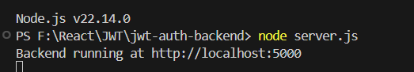

# 🔐 JWT Authentication Example (React + Express)

This project demonstrates how to implement simple JWT authentication using:

- **React** for the frontend
- **Express.js** for the backend
- **JWT (jsonwebtoken)** for authentication
- **Axios** for API calls

---

## 🧱 Backend Setup (Node.js + Express)

### 1. Create and Set Up the Backend

```bash
mkdir jwt-auth-backend
cd jwt-auth-backend
npm init -y
```


### 2. Install Required Packages

```bash
npm install express cors jsonwebtoken
```

### 3. Create server.js

Create a file called server.js and add the following code:

```js
const express = require("express");
const cors = require("cors");
const jwt = require("jsonwebtoken");

const app = express();
const SECRET = "supersecret";

app.use(cors());
app.use(express.json());

app.post("/login", (req, res) => {
  const { username, password } = req.body;
  if (username === "admin" && password === "password") {
    const token = jwt.sign({ username }, SECRET, { expiresIn: "1h" });
    return res.json({ token });
  }
  res.status(401).json({ message: "Invalid credentials" });
});

app.get("/protected", (req, res) => {
  const authHeader = req.headers.authorization;
  if (!authHeader)
    return res.status(401).json({ message: "No token provided" });

  const token = authHeader.split(" ")[1];
  try {
    const decoded = jwt.verify(token, SECRET);
    res.json({ message: `Hello, ${decoded.username}` });
  } catch (err) {
    res.status(403).json({ message: "Invalid token" });
  }
});

app.listen(5000, () => {
  console.log("Backend running at http://localhost:5000");
});
```

#### 4. Start the Server

```bash
node server.js
```



## ⚛️ Frontend Setup (React)

#### 1. Create React App

Open a new terminal and run:

```bash
npx create-react-app jwt-auth-frontend
cd jwt-auth-frontend
npm install axios
```

#### 2. Replace src/App.js with the Following:

```js
import React, { useState } from "react";
import axios from "axios";

const API_URL = "http://localhost:5000";

function App() {
  const [token, setToken] = useState(localStorage.getItem("token"));
  const [username, setUsername] = useState("");
  const [password, setPassword] = useState("");
  const [message, setMessage] = useState("");

  const login = async () => {
    try {
      const res = await axios.post(`${API_URL}/login`, { username, password });
      localStorage.setItem("token", res.data.token);
      setToken(res.data.token);
      setMessage("Login successful!");
    } catch (err) {
      setMessage("Login failed");
    }
  };

  const getProtected = async () => {
    try {
      const res = await axios.get(`${API_URL}/protected`, {
        headers: { Authorization: `Bearer ${token}` },
      });
      setMessage(res.data.message);
    } catch (err) {
      setMessage("Access denied");
    }
  };

  const logout = () => {
    localStorage.removeItem("token");
    setToken(null);
    setMessage("Logged out");
  };

  return (
    <div style={{ padding: 20 }}>
      {!token ? (
        <>
          <h2>Login</h2>
          <input
            placeholder="Username"
            value={username}
            onChange={(e) => setUsername(e.target.value)}
          />
          <br />
          <input
            type="password"
            placeholder="Password"
            value={password}
            onChange={(e) => setPassword(e.target.value)}
          />
          <br />
          <button onClick={login}>Login</button>
        </>
      ) : (
        <>
          <h2>Welcome</h2>
          <button onClick={getProtected}>Get Protected Data</button>
          <button onClick={logout}>Logout</button>
        </>
      )}
      <p>{message}</p>
    </div>
  );
}

export default App;
```

✅ Testing the App
Visit http://localhost:3000

Log in with:

Username: admin

Password: password

Click "Get Protected Data"

You should see: Hello, admin

Click "Logout" to clear the session
