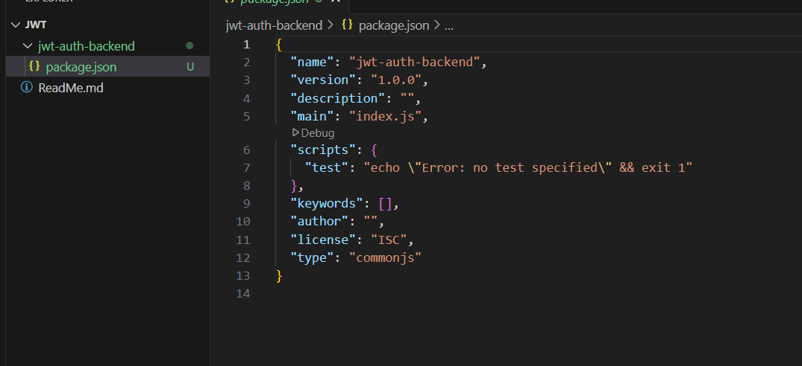

# 🔐 JWT Authentication Example (React + Express)

This project demonstrates how to implement simple JWT authentication using:

- **React** for the frontend
- **Express.js** for the backend
- **JWT (jsonwebtoken)** for authentication
- **Axios** for API calls

---

## 🧱 Backend Setup (Node.js + Express)

### 1. Create and Set Up the Backend

```bash
mkdir jwt-auth-backend
cd jwt-auth-backend
npm init -y
```



### 2. Install Required Packages

```bash
npm install express cors jsonwebtoken
```

### 3. Create server.js

Create a file called server.js and add the following code:

```js
const express = require("express");
const cors = require("cors");
const jwt = require("jsonwebtoken");

const app = express();
const SECRET = "supersecret";

app.use(cors());
app.use(express.json());

app.post("/login", (req, res) => {
  const { username, password } = req.body;
  if (username === "admin" && password === "password") {
    const token = jwt.sign({ username }, SECRET, { expiresIn: "1h" });
    return res.json({ token });
  }
  res.status(401).json({ message: "Invalid credentials" });
});

app.get("/protected", (req, res) => {
  const authHeader = req.headers.authorization;
  if (!authHeader)
    return res.status(401).json({ message: "No token provided" });

  const token = authHeader.split(" ")[1];
  try {
    const decoded = jwt.verify(token, SECRET);
    res.json({ message: `Hello, ${decoded.username}` });
  } catch (err) {
    res.status(403).json({ message: "Invalid token" });
  }
});

app.listen(5000, () => {
  console.log("Backend running at http://localhost:5000");
});
```

#### 4. Start the Server

```bash
node server.js
```
